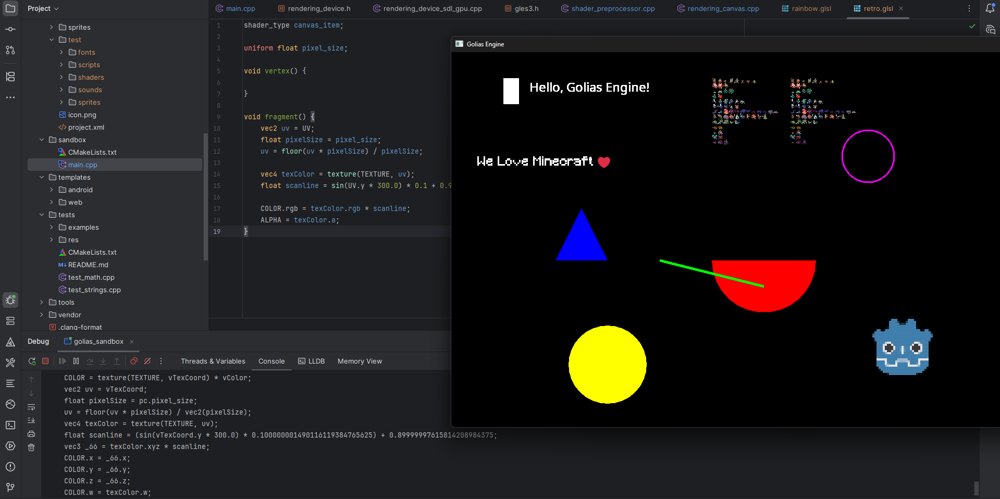
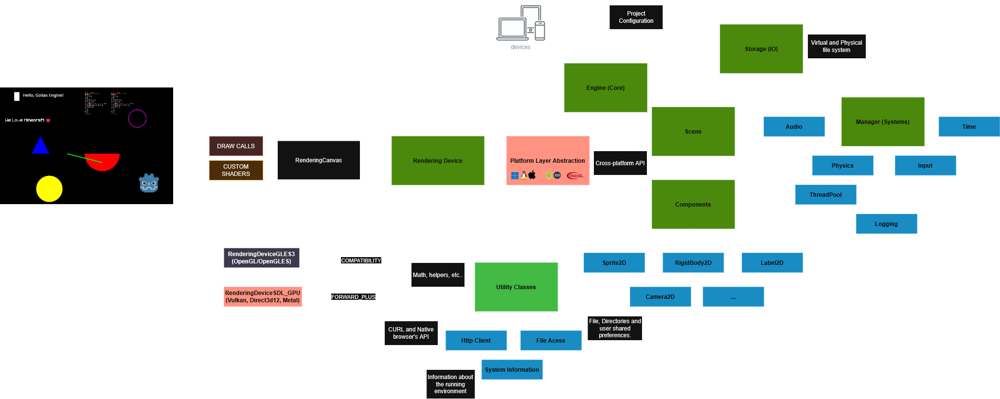
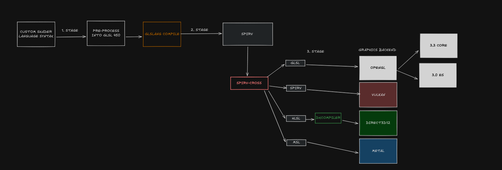
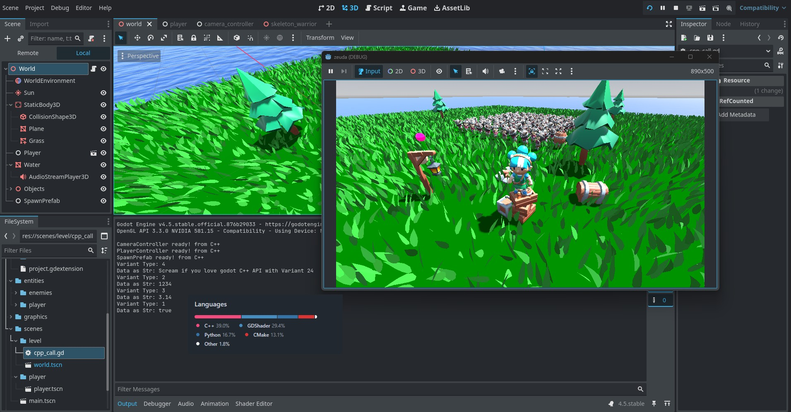

# Desenvolvimento de Software com C++ e Game Engines

Olá pessoal, esta postagem apresenta uma visão prática e teórica sobre o desenvolvimento de jogos e software utilizando **C++**, mostrando a experiência de criar uma game engine própria e também de utilizar C++ dentro da **Godot Engine** via **GDExtensions**. Além disso, farei uma comparação entre as principais game engines do mercado: **Godot**, **Unity** e **Unreal Engine**.

---

## Introdução

Nós sabemos que na programação existem diversas áreas, linguagens e ferramentas, porém, quando falamos de desenvolvimento de jogos, C++ é uma das linguagens mais poderosas e amplamente utilizada, especialmente em engines tanto públicas quanto privadas. No entanto, o desenvolvimento de jogos requer iteração rápida, ferramentas visuais e um ecossistema robusto, o que pode ser desafiador ao trabalhar diretamente com C++ por ser uma linguagem de baixo nível e consideravelmente complexa.

Neste artigo, compartilho experiências reais no desenvolvimento com C++, desde a criação de sistemas de engine até o uso de C++ dentro da Godot via GDExtensions, além de uma análise comparativa entre as principais game engines do mercado (Godot, Unity e Unreal Engine).




---

## Overview da Minha Game Engine

Criar uma game engine do zero é um desafio técnico significativo, mas extremamente enriquecedor do ponto de vista de aprendizado.

### Motivação

Sempre tive interesse em entender como engines funcionam por "de baixo dos panos". Decidi criar minha própria engine em C++ para:

- Aprender como gerenciar um projeto de software complexo.
- Aprender como funcionam e abstrair Pipelines gráficas (Opengl, OpenGLES, Vulkan, Direct3D12, Metal).
- Cross-compilar e exportar para múltiplas plataformas, atualmente (Windows, Linux, macOS, iOS, Android, WebGL).
- Aprender boas práticas de design de software.
- Melhorar minhas habilidades em C++ e Build Systems (CMake).
- Aprender sobre computação gráfica, matemática 3D e otimização de performance.
- Aprender sobre Testes automatizados, Integração de bibliotecas de terceiros e CI/CD. (Parece algo trivial, mas em C++ requer um esforço significativo).

### Arquitetura Geral

Atualmente a engine possui features básicas 2D/3D, com maior ênfase em 2D,  separando responsabilidades como renderização, recursos, input e loop principal. Abaixo é apresentada uma visão geral da arquitetura do software.



## Pipeline Gráfica e Shaders -- O coração de uma Engine

A engine implementa uma **pipeline gráfica abstrata** inspirada em como engines modernas organizam seus sistemas de renderização para oferecer uma interface simples, legível e desacoplada do backend gráfico.

Em vez de expor diretamente conceitos de baixo nível — como comandos de GPU, estados explícitos ou sincronização manual — a engine trabalha com **abstrações de alto nível** que representam intenções de renderização. O código da aplicação descreve *o que* deve ser desenhado, e não *como* cada API gráfica executa essa operação internamente.

Essa abordagem normalmente se baseia em alguns pilares comuns entre engines modernas:

- **Interfaces comuns para múltiplos backends**, onde cada API gráfica implementa o mesmo conjunto de contratos (por exemplo: criação de buffers, pipelines, texturas e comandos).
- **Objetos imutáveis ou semi-imutáveis**, como pipelines e materiais, que reduzem estados globais e tornam o fluxo de renderização mais previsível.
- **Separação clara entre lógica de jogo e renderização**, evitando que código de gameplay conheça detalhes da GPU.

Sem a necessidade de lidar diretamente com as diferenças entre backends gráficos como OpenGL, OpenGLES, Vulkan, Metal ou Direct3D12.

No caso dos shaders, engines modernas possuem uma pipeline de shaders em conjunto com abstrações que permitem escrever shaders em uma linguagem de alto nível (baseada em GLSL ou HLSL) e compilá-los para múltiplas plataformas. A engine gerencia o pre-processamento, geração de código, otimização e vinculação dos shaders conforme o backend gráfico utilizado como demonstrado abaixo: 



### Prós de Criar uma Engine Própria

- "Controle total" sobre o código e decisões técnicas. (o que pode ser um contra também).
- Aprendizado profundo de C++ e computação gráfica no geral.
- Abstração personalizada para necessidades específicas.
- Redução "bloated code" de engines comerciais e excesso de features.
- Ideal para fins educacionais e projetos experimentais.

### Contras

- Alto custo de tempo.
- Necessidade de implementar muitas features e ferramentas básicas para se tornar relativamente utilizável.
- Lidar com um sistema de "Scripting" é complexo (principalmente com C#, onde a integração e compilação para código nativo é extremamente complexa e.g UnityIL2CPP).
- Falta de editor visual, física, pipelines gráficas e de assets pronta.
- Manutenção contínua é complexa.
- Comunidade e suporte limitados.
- Portabilidade e otimização para múltiplas plataformas é um desafio significativo.
- Dificuldade em competir com engines comerciais maduras.

Mesmo que a engine não vire um produto final, o conhecimento adquirido é altamente reaproveitável.


---

## Experiência Utilizando C++ e Godot Engine

A Godot Engine permite desenvolvimento em várias linguagens, sendo o **GDExtension** a forma oficial de integrar código C++ nativo.
A Godot Engine tem suporte oficial para GDScript e C# (via Mono), mas o GDExtension oferece uma alternativa poderosa para quem deseja utilizar C++ e diversas outras linguagens.

### Por que C# na Godot é considerado ruim?

Por não existir uma Pipeline similar a IL2CPP (C# -> C++ -> Nativo) como a Unity, o C# na Godot roda via Mono (uma implementação do .NET), o que traz algumas limitações:

- Performance inferior comparada a código nativo.
- Integração mais complexa com a API da Godot.
- Tamanho maior do binário final devido à inclusão do runtime Mono.
- Sem Supporte oficial para exportação Web (WASM).
- Exportação para Mobile (iOS/Android) ainda é `experimental` e com diversas limitações.


### O que é GDExtension (Godot Extension)?

GDExtension permite criar bibliotecas em diversas linguagens que são carregadas dinamicamente pela Godot, possibilitando:

- Execução de código nativo.
- Melhor desempenho em sistemas críticos.
- Integração direta com a API da engine.
- Flexibilidade para usar C++ e outras linguagens.

### Prós do Uso de C++ na Godot

- Alto desempenho.
- Reuso de bibliotecas C++ existentes.
- Ideal para lógica pesada (IA, física customizada, geração procedural).
- Hot-reload durante o desenvolvimento.

### Contras

- Setup inicial complexo.
- Iteração mais lenta comparada a GDScript.
- Documentação ainda limitada em alguns pontos.
- Debug é bastante complexo.


---

## Tutorial Básico de GDExtensions

Abaixo está uma demo de um jogo 3D simples feito com **C++ na Godot**, utilizando **GDExtensions**:

[Projeto Exemplo C++ na Godot](https://github.com/vsaint1/godot-demo-cpp)



### Requisitos

- Godot Engine 4.x
- Conhecimento básico de C++
- SCons (build system da Godot)
- Emscripten (para build Web / WASM)

---

### 1. Criando o Projeto

Utilize o template oficial para GDExtensions:

- https://github.com/godotengine/godot-cpp-template

Esse template já contém:
- Estrutura correta do projeto
- Configuração inicial do SCons
- Integração com o SDK da Godot

---

### 2. Criando uma Classe Exposta à Godot

```cpp
#include <godot_cpp/classes/node.hpp>

using namespace godot;
 //Obs: Caso vc extenda a lógica dessa classe com GDscript, o método será sobrescrito.
class HelloGodotCPP : public Node {
    GDCLASS(HelloGodotCPP, Node);

public:
   
    void _ready(){
        print_line("Hello from C++ in Godot!");
    }

    void _process(double delta) {
       // Fazendo alguma coisa 123
    }
};
````

Essa classe se comporta como qualquer `Node` da Godot, mas sua lógica é executada em **C++ nativo**.

---

### 3. Registrando a Classe

```cpp
void initialize_gdextension_types(ModuleInitializationLevel p_level)
{
    if (p_level != MODULE_INITIALIZATION_LEVEL_SCENE) {
        return;
    }

    GDREGISTER_CLASS(HelloGodotCPP);
}
```

Esse passo é obrigatório para que a Godot reconheça a classe C++.

#### 3.1 Diferença entre GDREGISTER_CLASS e GDREGISTER_RUNTIME_CLASS

* `GDREGISTER_CLASS`
  Registra a classe para uso no **editor e em tempo de execução**.

* `GDREGISTER_RUNTIME_CLASS`
  Registra a classe **apenas em tempo de execução**, não ficando disponível no editor.

---

### 4. Cross-compilando para Web (WASM) com Emscripten

Uma das grandes vantagens do GDExtension é permitir **cross-compilação** para múltiplas plataformas, incluindo **WebAssembly**.

#### 4.1 Instalando o Emscripten

Siga o guia oficial:

* [https://emscripten.org/docs/getting_started/downloads.html](https://emscripten.org/docs/getting_started/downloads.html)

Após instalar, certifique-se de que o ambiente está ativo:

```bash
source emsdk_env.sh
```

---

### 4.2 Compilando a GDExtension para Web

A Godot utiliza **Emscripten** para gerar bibliotecas `.wasm`. Para isso, execute o SCons com a plataforma web:

```bash
scons platform=web target=template_release
```

Isso irá gerar os artefatos necessários para WebAssembly, incluindo:

* `.wasm`
* arquivos intermediários de binding

---

### 5. Registrando a Biblioteca Web no Projeto Godot

Abaixo contém um arquivo de configuração da GDExtension que informa à Godot quais bibliotecas carregar para cada plataforma (Windows, Linux, macOS, iOS, Android, Web):

```ini
[configuration]

entry_symbol = "example_library_init"
compatibility_minimum = "4.1"
reloadable = true # Permite hot-reload no editor

[libraries]
macos.debug = "res://bin/macos/example.macos.template_debug.framework"
macos.release = "res://bin/macos/example.macos.template_release.framework"
ios.debug = "res://bin/ios/example.ios.template_debug.xcframework"
ios.release = "res://bin/ios/example.ios.template_release.xcframework"
windows.debug.x86_32 = "res://bin/windows/example.windows.template_debug.x86_32.dll"
windows.release.x86_32 = "res://bin/windows/example.windows.template_release.x86_32.dll"
windows.debug.x86_64 = "res://bin/windows/example.windows.template_debug.x86_64.dll"
windows.release.x86_64 = "res://bin/windows/example.windows.template_release.x86_64.dll"
linux.debug.x86_64 = "res://bin/linux/example.linux.template_debug.x86_64.so"
linux.release.x86_64 = "res://bin/linux/example.linux.template_release.x86_64.so"
linux.debug.arm64 = "res://bin/linux/example.linux.template_debug.arm64.so"
linux.release.arm64 = "res://bin/linux/example.linux.template_release.arm64.so"
linux.debug.rv64 = "res://bin/linux/example.linux.template_debug.rv64.so"
linux.release.rv64 = "res://bin/linux/example.linux.template_release.rv64.so"
android.debug.x86_64 = "res://bin/android/example.android.template_debug.x86_64.so"
android.release.x86_64 = "res://bin/android/example.android.template_release.x86_64.so"
android.debug.arm64 = "res://bin/android/example.android.template_debug.arm64.so"
android.release.arm64 = "res://bin/android/example.android.template_release.arm64.so"
web.wasm32.debug = "res://bin/web/example.web.template_debug.wasm32.nothreads.wasm"
web.wasm32.release = "res://bin/web/example.web.template_release.wasm32.nothreads.wasm"

```

Esse arquivo informa à Godot qual biblioteca deve ser carregada para cada plataforma.

---

### 6. Executando no Editor e Exportando para Web

* A classe `HelloGodotCPP` aparecerá como um **Node comum** no editor.
* O mesmo código C++ funcionará em:

  * Desktop
  * Mobile
  * Web (WASM)

Durante a exportação para Web, a Godot automaticamente integrará a biblioteca WASM gerada pelo Emscripten.

---

Esse fluxo demonstra como é possível escrever **código C++ uma única vez** e executá-lo em múltiplas plataformas, combinando a produtividade da Godot com a performance e controle do C++.


---

## Comparação entre Godot, Unity e Unreal Engine

### Godot

**Prós**

* Open source e sem royalties.
* Excelente para 2D.
* Rápida iteração com GDScript.
* Extremamente modular com GDExtensions.

**Contras**

* Menor ecossistema.
* Ferramentas 3D menos maduras.
* Integração C++ exige mais configuração.
* Pipelines gráficas menos avançadas e com menos abstrações de alto nível.
* Comunidade e Ecosistema menor se comparada a Unity ou Unreal.
* Portabilidade para consoles é limitada por ser Open Source ( Porém existe W4Consoles que oferece esses serviços).
* A Engine é relativamente nova se comparada a Unity e Unreal, o que pode resultar em menos tutoriais e conteúdos sobre certos tópicos.
* Fácilmente decompilável para código fonte e assets. (A encriptação é bastante fraca e além de ser Open Source, existem ferramentas para extrair assets e código fonte como gdsdecomp).
* Forte dependência de um modelo orientado a objetos baseado em herança (Nodes), onde um único Node pode acumular múltiplos níveis de herança. Resultando em impactos diretos em performance, como **cache misses frequentes**, **uso excessivo de ponteiros para funções (vtable)** e menor previsibilidade de acesso à memória, dificultando otimizações em grandes cenas ou projetos complexos.

---

### Unity

**Prós**

* Comunidade enorme.
* Grande quantidade de assets e plugins.
* Engine com maior número de plataformas suportadas.
* Pipeline de IL2CPP ( C# -> C++ -> Nativo) para melhor performance.
* Ferramentas maduras e editor robusto.
* Testada em produção por anos.
* ECS (Entity Component System) para melhor performance e escalabilidade. (Por de baixo dos panos, MonoBehaviour utiliza um sistema baseado em componentes, mas não é um ECS puro como o DOTS).
* Sólido 2D e 3D.


**Contras**

* Engine proprietária e paga, com modelo de negócios baseado em assinaturas.
* Diversas funcionalidades avançadas e recursos recentes ficam **bloqueados por paywall**, dependendo do plano contratado. (e.g PlatformToolkit (Unity 6.3) que exige plano Pro para utilizar a SDK da Steam e Mobile)
* Mudanças frequentes no modelo de licenciamento, gerando insegurança para desenvolvedores e estúdios.
* Menor controle sobre arquitetura interna e sistemas críticos.
* Parte do ecossistema é fragmentada entre pacotes oficiais, experimentais e/ou pagos.
* Extremamente fácil fazer cheats e mods em jogos feitos com Unity Engine, devido a facilidade de engenharia reversa e ferramentas amplamente disponíveis na internet. 

---

### Unreal Engine

**Prós**

* Excelentes gráficos "sem esforço".
* Engine com Suporte robusto para C++ nativo.
* Ferramentas visuais poderosas (Blueprints, Niagara, Material Editor).
* Uma das engines com a maior abstração de pipelines gráficas e sistemas complexos.
* Grande comunidade e ecossistema.
* Blueprints facilitam prototipação e o desenvolvimento.
* Source Available (é diferente de Open Source).
* Sólido 3D e VR/AR.

**Contras**

* Curva de aprendizado extremamente alta.
* Por ser uma engine bastante complexa e robusta, a quantidade de features pode ser esmagadora para iniciantes.
* Requer hardware potente para desenvolvimento.
* Diversas features que poderão ser desnecessárias para projetos menores.
* Suporte limitado para 2D e Exportação para Web (WASM).
* Possui um dos piores sistemas de build (exportação do projeto) e integração contínua (CI/CD) entre as engines comerciais.
* Extremamente fácil fazer cheats e mods em jogos feitos com Unreal Engine, devido a facilidade de engenharia reversa e ferramentas amplamente disponíveis na internet. 

---


> A parte de criação de cheats ou mods em jogos feitos em Engines comerciais é um ponto importante a ser considerado, especialmente para jogos multiplayer ou competitivos, onde a integridade do jogo é crucial. A facilidade de engenharia reversa pode comprometer a segurança e a experiência do jogador, exigindo que os desenvolvedores implementem medidas adicionais de proteção contra trapaças.

## Conclusão

A escolha entre criar uma engine própria ou usar uma game engine existente depende diretamente dos objetivos do projeto, para aprendizado, criar uma engine ou jogo em c++ é extremamente válido. Por fim, não existe uma resposta única para todos os casos, cada abordagem tem seus méritos e desafios.


